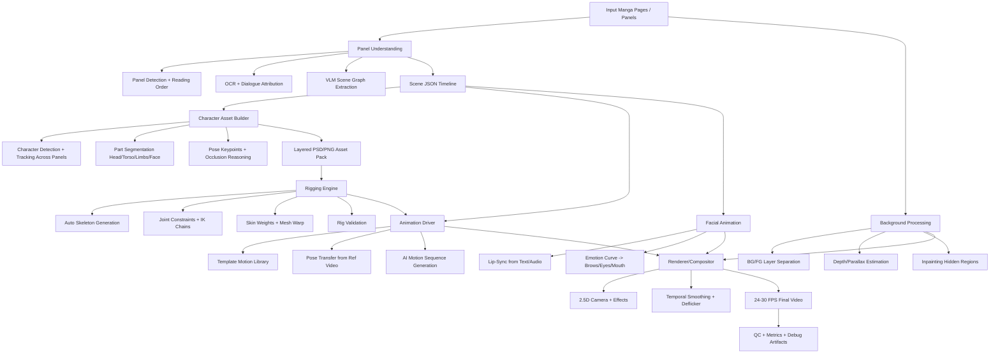

# Manga-to-Animation (2D Puppet) System Design for Google Colab

## 1) Production Architecture (Quality-first, Local Open Source)



---

## 2) Panel Understanding

### Objectives
- Detect panels, reading order, speech balloons, SFX text.
- Identify characters, actions, emotions, scene type (fight, dialogue, establishing shot, reaction).
- Produce structured JSON driving all downstream modules.

### Recommended local models
1. **Panel detection/layout**
   - `YOLOv8/YOLOv10` fine-tuned on manga panel datasets.
   - Fallback: `Detectron2 Mask R-CNN` for robust region proposals.
2. **OCR**
   - `MangaOCR` (Japanese-optimized) + `PaddleOCR` multilingual fallback.
3. **Vision-language scene parsing**
   - `LLaVA-1.6`, `Qwen2-VL`, or `InternVL2` (local weights via Hugging Face).
4. **Entity relation extraction**
   - `DeBERTa-v3` classifier for emotion/action labels from OCR + VLM outputs.

### Output schema (example)
```json
{
  "page_id": "p003",
  "panel_id": "p003_04",
  "reading_order": 12,
  "scene_type": "dialogue_closeup",
  "camera_hint": "slow_push_in",
  "characters": [
    {
      "char_id": "char_akira",
      "bbox": [210, 75, 514, 880],
      "pose": {"keypoints_2d": [...]},
      "emotion": "angry",
      "action": "pointing"
    }
  ],
  "dialogue": [
    {
      "speaker": "char_akira",
      "text": "I won't lose.",
      "balloon_bbox": [560, 120, 870, 330],
      "timing_sec": [0.8, 2.4]
    }
  ],
  "sfx": [
    {"text": "BAM", "bbox": [920, 410, 1080, 520], "intensity": 0.9}
  ],
  "style_tags": ["speed_lines", "dramatic_shading"]
}
```

---

## 3) Character Extraction

### Pipeline
1. Character instance detection per panel.
2. Identity association across panels (ReID embedding + hairstyle/clothing cues).
3. Part segmentation:
   - head, hair, neck, torso, upper/lower arms, hands, upper/lower legs, feet,
   - face parts: eyes, brows, pupils, mouth, teeth, tongue.
4. Occlusion splitting + alpha matting.
5. Export layered assets:
   - `/assets/chars/<char_id>/<panel_id>/layers/*.png`
   - masks + pivot hints + metadata.

### Recommended models
- **Segmentation**: `SAM2` / `HQ-SAM`, fallback `BiSeNet`/`U2Net`.
- **Pose**: `DWpose` or `OpenPose`.
- **Matting**: `RVM` or `MODNet`.
- **ReID**: `fastreid` embeddings.

---

## 4) Rigging Engine (Auto Puppet)

### Rig generation strategy
- Build canonical 2D skeleton from extracted body landmarks:
  - root, spine, neck, head, shoulders, elbows, wrists, hips, knees, ankles.
- Auto-pivot estimation by mask geometry (joint centers at narrow articulation zones).
- Mesh each part (triangulated 2D mesh) and bind to nearest bones.
- Compute skin weights using geodesic distance + stiffness priors:
  - rigid for face/hair chunks,
  - smooth for torso/limbs.
- IK constraints:
  - foot pinning,
  - elbow/knee bend limits,
  - neck/head rotation clamp.

### Suggested implementation stack
- `PyTorch` for model inference.
- `numpy/scipy` for rig math.
- `opencv + shapely + trimesh` for geometry.
- Optional DCC export (`Live2D JSON`, `Spine JSON`) for interoperability.

---

## 5) Animation Driver (Three Motion Modes)

### Mode A: Template motion
- Pre-authored clips mapped by scene/action labels:
  - idle_talk, walk_cycle, hit_react, turn_head, dramatic_pose.
- Retarget via IK to character proportions.

### Mode B: Pose-transfer motion
- Input: reference video or pose sequence.
- Extract keypoints via `DWpose`.
- Temporal smoothing (`OneEuro`/Savitzky–Golay).
- Retarget onto puppet skeleton with limb-length normalization.

### Mode C: AI-generated motion sequence
- Use diffusion/video models to propose pose trajectories (not final render):
  - `AnimateDiff`, `MimicMotion`, or motion transformer checkpoints.
- Convert generated latent motion to 2D keypoint curves.
- Apply physically-plausible constraints (velocity/acceleration caps, planted feet).

### Scheduling
- Scene JSON selects mode per shot:
  - dialogue → template + micro facial motion,
  - action panel → AI-generated + manual constraint pass,
  - emotional closeup → template + facial emphasis.

---

## 6) Facial Animation

### Lip sync
- If audio exists: `Rhubarb Lip Sync` or `Wav2Lip` (local).
- Text-only fallback:
  - G2P (phonemizer/espeak)
  - phoneme-to-viseme mapping
  - viseme timing from dialogue duration model.

### Emotion controls
- Emotion classifier output drives blendshape curves:
  - brows_up/down, eye_open/squint, pupil_scale, mouth_smile/frown.
- Add stochastic micro-motions (blink, saccades, subtle head bob).

---

## 7) Background Processing

### Steps
1. Separate characters/foreground from background (segmentation masks).
2. Estimate depth map (`MiDaS`/`Depth-Anything`).
3. Build layered BG planes (near/mid/far).
4. Inpaint disoccluded areas using `LaMa`/`SD inpainting`.
5. Generate camera path for parallax (pan/zoom/dolly).

### Output
- Layered BG package:
  - `bg_near.png`, `bg_mid.png`, `bg_far.png`, `depth.exr`, `camera_path.json`.

---

## 8) Rendering Engine

### Composition
- Z-ordered compositing:
  - BG planes + character puppets + FX (speed lines, impact flashes, particles).
- 2.5D camera transforms from scene directives.
- Temporal post-process:
  - anti-flicker, line-consistency correction, color stabilization.

### Export
- Render at 24–30 FPS via `ffmpeg` (ProRes/H.264/H.265).
- Audio mix with dialogue, ambience, SFX.

---

## 9) Model List + Download Links (Open Source)

- SAM2: https://github.com/facebookresearch/sam2
- HQ-SAM: https://github.com/SysCV/sam-hq
- OpenPose: https://github.com/CMU-Perceptual-Computing-Lab/openpose
- DWPose: https://github.com/IDEA-Research/DWPose
- MangaOCR: https://github.com/kha-white/manga-ocr
- PaddleOCR: https://github.com/PaddlePaddle/PaddleOCR
- LLaVA: https://github.com/haotian-liu/LLaVA
- Qwen2-VL: https://github.com/QwenLM/Qwen2-VL
- InternVL: https://github.com/OpenGVLab/InternVL
- MiDaS: https://github.com/isl-org/MiDaS
- Depth-Anything: https://github.com/LiheYoung/Depth-Anything
- LaMa: https://github.com/advimman/lama
- AnimateDiff: https://github.com/guoyww/AnimateDiff
- MimicMotion: https://github.com/Tencent/MimicMotion
- Wav2Lip: https://github.com/Rudrabha/Wav2Lip
- Rhubarb: https://github.com/DanielSWolf/rhubarb-lip-sync
- FastReID: https://github.com/JDAI-CV/fast-reid

---

## 10) Colab Installation Script (Single Runtime)

Create `scripts/install_manga_animator_colab.sh`:

```bash
#!/usr/bin/env bash
set -euo pipefail

# Core
pip install -U pip setuptools wheel
pip install torch torchvision torchaudio --index-url https://download.pytorch.org/whl/cu121
pip install xformers==0.0.28.post3
pip install opencv-python-headless numpy scipy scikit-image shapely trimesh einops imageio ffmpeg-python
pip install transformers accelerate bitsandbytes sentencepiece safetensors
pip install diffusers==0.30.0 peft

# OCR + CV
pip install manga-ocr paddleocr paddlex
pip install ultralytics detectron2 -f https://dl.fbaipublicfiles.com/detectron2/wheels/cu121/torch2.4/index.html

# Pose + utilities
pip install onnxruntime-gpu mediapipe
pip install git+https://github.com/IDEA-Research/DWPose.git

# Background + depth
pip install timm

# Optional lip sync tools
pip install phonemizer pydub librosa

# Clone model repos/checkpoints folders
mkdir -p /content/models /content/repos
cd /content/repos

# Example clones (pin commits in production)
git clone https://github.com/facebookresearch/sam2.git
git clone https://github.com/advimman/lama.git
git clone https://github.com/guoyww/AnimateDiff.git

echo "Install complete"
```

> Note: in production, pin exact versions + checkpoint hashes in a lockfile to guarantee deterministic rebuilds.

---

## 11) End-to-End Execution Order

1. Ingest pages/panels.
2. Panel detection + reading order.
3. OCR + dialogue balloon linking.
4. VLM scene parsing → shot-level JSON.
5. Character extraction + part segmentation + identity tracking.
6. Auto-rig generation + weight binding.
7. Motion planning (template / pose-transfer / AI-gen).
8. Facial animation from dialogue/emotion.
9. Background layer/depth/inpaint.
10. Compositing + camera + FX.
11. Render and encode final video.
12. QC metrics + artifact logs.

---

## 12) Suggested Repository Structure

```text
manga-animator/
  configs/
    model_registry.yaml
    runtime_profiles.yaml
  data/
    input_pages/
    intermediate/
    output/
  models/
    checkpoints/
  src/
    panel_understanding/
    character_extraction/
    rigging/
    animation_driver/
    facial_animation/
    background/
    renderer/
    orchestration/
  scripts/
    install_manga_animator_colab.sh
    run_pipeline.py
    benchmark.py
  notebooks/
    colab_end_to_end.ipynb
  tests/
    test_scene_json.py
    test_rigging_constraints.py
    test_render_smoke.py
  docs/
    system_design.md
```

---

## 13) Training / Fine-tuning (Only Where Needed)

- **Panel detector fine-tune** (high impact):
  - dataset: Manga109 annotations or custom labeled pages.
  - objective: panel bbox/mask + reading order head.
- **Character part segmentation**:
  - synthetic training with pseudo-labels from SAM + manual corrections.
- **Emotion/action classifier**:
  - train lightweight classifier on VLM captions + human labels.
- **Motion prior model (optional)**:
  - fine-tune pose sequence generator on anime motion clips.

Use LoRA/QLoRA for VLM adapters to fit Colab memory.

---

## 14) Compute & Memory Estimates (Colab)

### Recommended runtime
- **A100 40GB** preferred (best quality, fewer fallbacks).
- Viable: **L4 24GB** or **T4 16GB** with reduced batch and quantization.

### Stage estimates (per ~100 panels)
- Panel/OCR/VLM parsing: 20–45 min (7B–13B VLM, 4-bit quantized).
- Segmentation + pose + matting: 30–60 min.
- Rigging + asset pack build: 10–20 min.
- Animation generation + retarget: 30–90 min (depends on AI motion usage).
- BG depth + inpaint: 20–50 min.
- Render (1080p, 24fps, 1–2 min video): 20–40 min.

Peak VRAM by heavy stage:
- VLM inference: 14–32 GB.
- Diffusion motion generation: 12–24 GB.
- SD inpainting: 10–18 GB.

---

## 15) VRAM Optimization and Fallback Profiles

### High-quality profile (A100)
- VLM 13B 4-bit, full-resolution SAM2, AnimateDiff 16–24 frames/chunk, SDXL inpainting.

### Balanced profile (L4)
- VLM 7B 4-bit, tiled SAM2 inference, 8–12 frame motion chunks, LaMa inpainting.

### Survival profile (T4)
- Replace VLM with smaller Qwen2-VL variant.
- Use YOLO + OCR + rule-based scene tags.
- Template motion only (disable AI-generated motion).
- Render at 720p then upscale.

General tactics:
- mixed precision (`fp16`/`bf16`), attention slicing, VAE tiling,
- sequential CPU offload for diffusion,
- gradient checkpointing during fine-tuning,
- process panel batches by scene clusters.

---

## 16) Major Failure Points + Fixes

1. **Character identity drift across panels**
   - Fix: ReID embedding cache + outfit/hair descriptors + manual override table.
2. **Pose jitter / limb snapping**
   - Fix: temporal filtering + joint-angle constraints + IK stabilization.
3. **Mouth sync uncanny**
   - Fix: viseme smoothing, hold frames for plosives, emotion-mouth blend priority rules.
4. **Background warping artifacts during camera moves**
   - Fix: stronger inpaint masks, multi-plane depth splitting, reduce camera amplitude.
5. **Line-art flicker between frames**
   - Fix: edge-aware temporal consistency pass and line thickness normalization.
6. **OOM crashes in Colab**
   - Fix: auto profile downgrade, chunked inference, unload models between stages.

---

## 17) Orchestration Notes (Research Prototype to Production)

- Build each stage as resumable jobs with checkpointed artifacts.
- Keep strict schema contracts (scene JSON, rig JSON, camera JSON).
- Log per-shot diagnostics: masks, rigs, keypoint curves, render previews.
- Add "human-in-the-loop" correction UI (optional) for panel parsing and rig pivots.
- Deterministic runs: seed control + pinned model versions + hash-verified checkpoints.

This design yields a production-ready research prototype that is fully local, Colab-compatible, quality-first, and resilient to runtime constraints.
